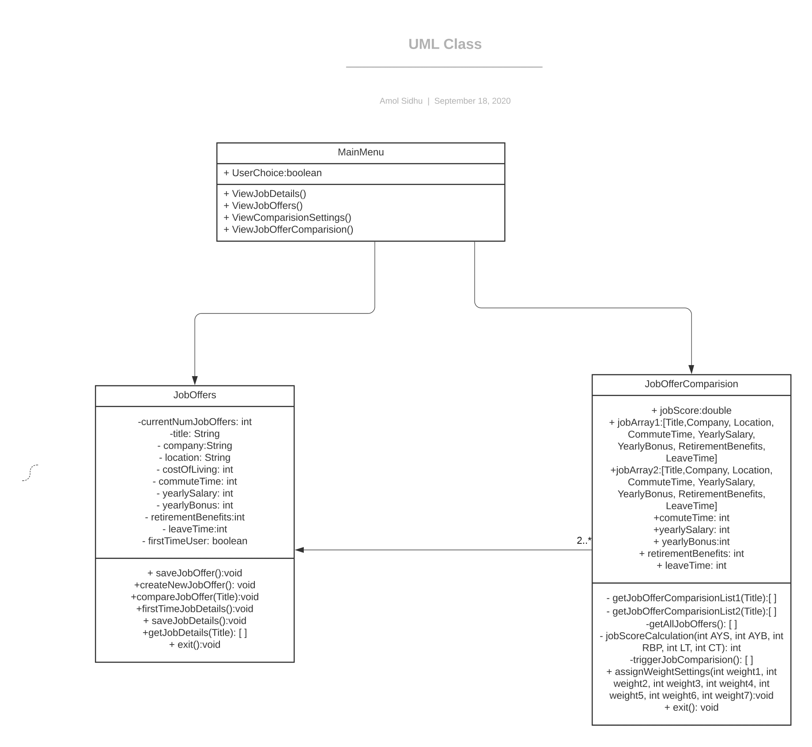
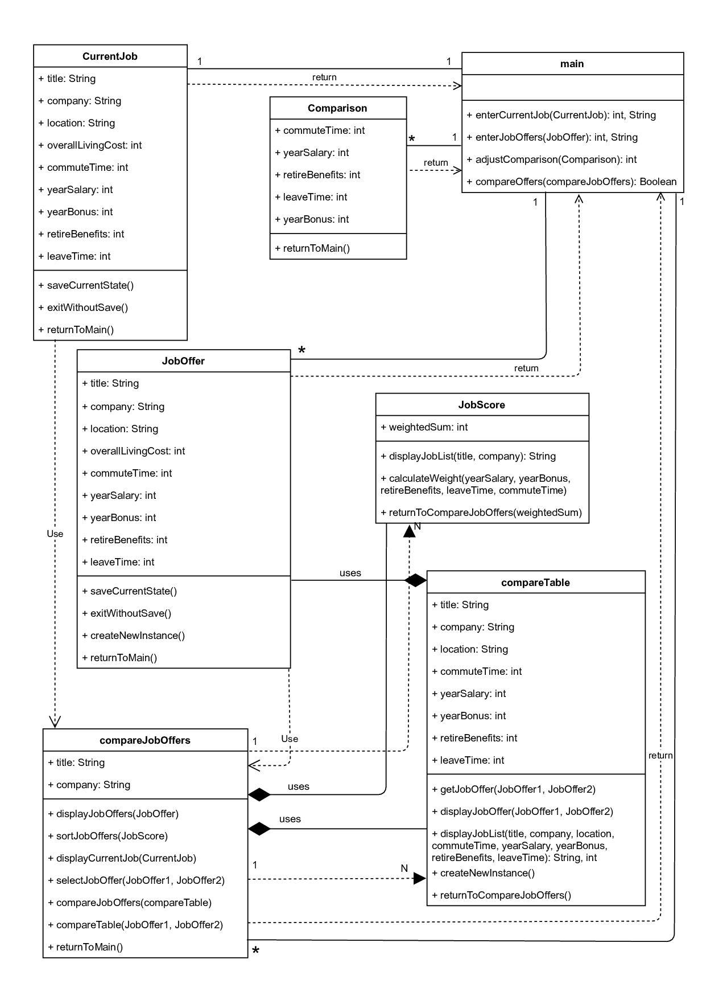
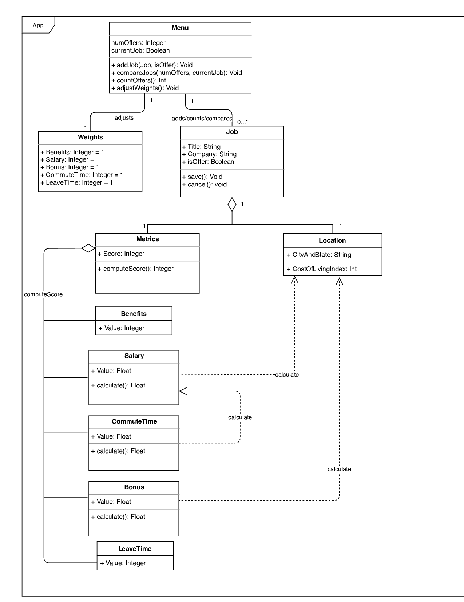
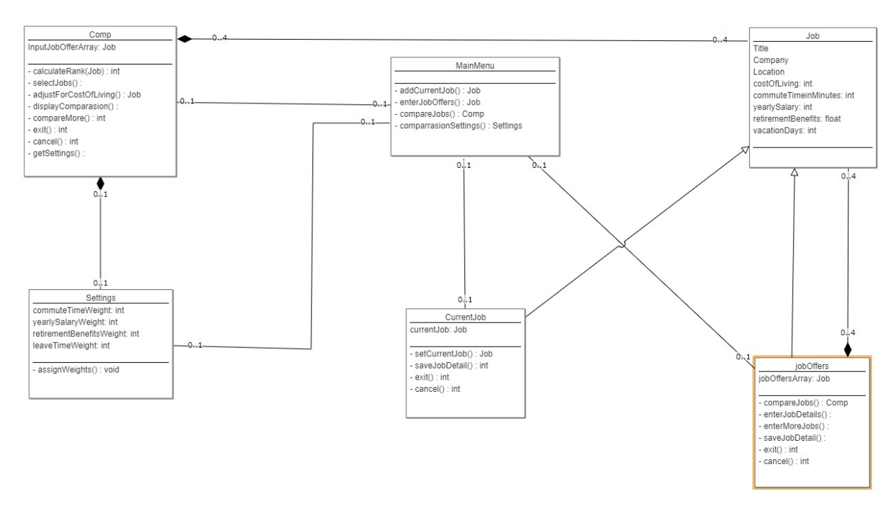
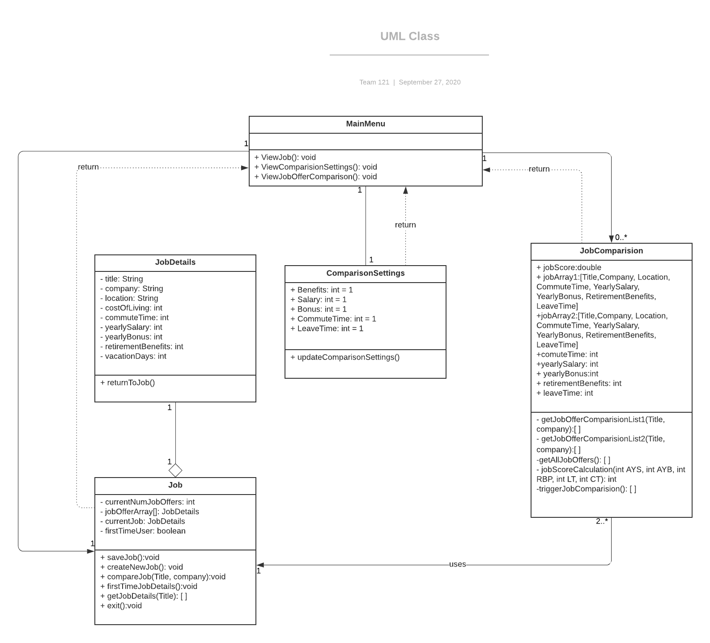

# Team 121 Design Discussion

## Section A: Individual Designs

### Design 1 - asidhu8

#### Strengths 
The simplicity and minimalism of the design is remarkable. The design is fairly self-explanatory and a lot of the complexities have been broken down.

#### Suggestions
Some of the relationships are not so clear. The dependency on the `JobOffers` class from the `JobOfferComparision` class should be represented with a different line. Additionally, the relationship between the `JobOfferComparison` class and the `JobOffers` class should be more explicit (it seems to be two-to-many, but its not so clear). The class structure could be more partitioned to differentiate, for instance, the current job viewing and the job offers and job comparisons. Encapsulating `JobOffers` and `JobOfferComparison` into a single class and instantiating it correspondingly could be more efficient.

### Design 2 - eanwanane3

#### Strengths 
The design is intricate and well-organized. UML symbols are used optimally to show the various class relationships. The mastery of UML conventions is apparent. 

#### Suggestions
Some of the design seems a bit more complex than necesssary. There are a few details which can be omitted since they may be implied by the implementation (i.e. GUI), such as the `exitWithoutSave` method. This could be handled by an exit button which would redirect the user within the client. There are some pairs of classes in the design which can be combined since they share many of the same attributes, such as the `compareTable`/`compareJobOffers` and `CurrentJob`/`JobOffer` classes,

### Design 3 - crodrigue3

#### Strengths 
The flow of the diagram made sense and was easy to understand. The way that the job metrics were broken down into subclasses to separate the dependencies was logical and coherent.

#### Suggestions
Adding a `JobComparision` class would be a very useful addition to the diagram to better represent the system. The individual job metric subclasses can be combined into one class (e.g class `JobDetails`) to avoid having too many classes in the overall design. 

### Design 4 - mtiwari38

#### Strengths 
The design was very unique and well thought out. The use of the array in the `jobOffers` class is a smart alternative to instantiating multiple job offer objects. It's an efficient design without redundant classes or attributes.

#### Suggestions
The `compareJobs` method in the `jobOffers` class returns `Comp`, but the relationship to the `Comp` class isn't shown as an element of the UML diagram. Additionally, some multiplicities shown may not be accurate, such as the 0 to 1 multiplicity for the main menu. Another suggestion is to change `retirementBenefits` from a float to a double due to the higher precision of doubles.

## Section B: Team Design
### Team Design

We decided to use Amol's design, Design 1, as a base since it is the most minimal of the four individual designs. As the most minimal design, it would be easy to add elements to it.  We used Manish's job inheritance and array ideas to reduce the number of job-related classes, simplifying the design while still achieving the requirements. We also used Edidiong's and Chris's `ComparisonSettings` class idea and the way that they incorporated it with the main menu. We kept the main menu attributeless with the minimum number of methods required to display the other components of the application.

## Section C: Summary
For this deliverable, we analyzed each others' designs and commented on the relative strengths of each one. We added suggestions for each design so that we would all be aware of any oversights and learn from our mistakes. We decided as a group to choose the simplest individual design as a starting point for the group design, and added the best features from each design to converge on an optimal solution.

From a project management standpoint, we experienced the challenge of working and coordinating across different time-zones. To simplify things, we created a team Slack channel for centralized communication. We've been using the Slack channel to discuss the deliverables, coordinate schedules and plan meetings. We decided to set soft milestone deadlines to ensure that we stay on track and maintain accountability.
