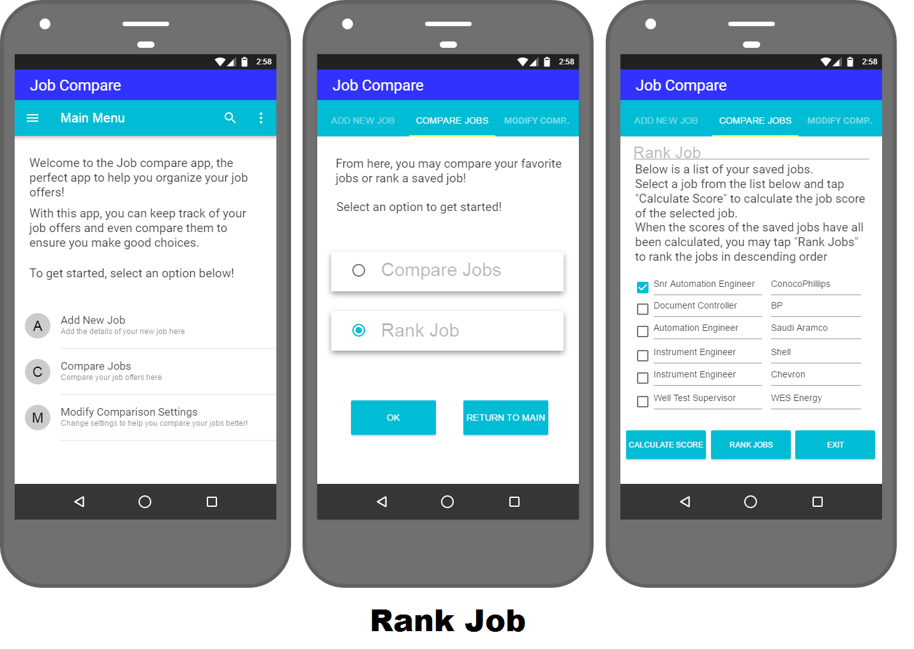

# Design Document

In this design document we consider several critical design aspects of the JobCompare6300 application developed by Team 121. The aspects are shown in the sections below.

**Author**: Team 121

**Version History**:

- Version 1 - Initial release.
- Version 2 - Updated Design Document for Deliverable 3 to revise the class diagram and sequence diagram to reflect the alpha/beta version of the app.
- Version 3 - Updated for Deliverable 4 (updated the Component Diagram, Deployment Diagram and Low Level Design description).

## 1 Design Considerations

### 1.1 Assumptions

In the design of this application, the team assumed that there would only be one user using or accessing the system at a given time, especially at this design phase. This would therefore mean that concurrency would not apply to the application. We the team also assume that this application would be restricted to Android mobile phone devices. All the data for the job creation is stored locally on the phone via a backend database server implementation.

### 1.2 Constraints

This app will need to have read and write access to an Android SQL database (SQLite). Users will have to access job details (title, company, location, commute time, yearly salary, yearly bonus, retirement benefits and leave time) for each job (job offer or current job), as well as the job scores for saved jobs. Also, a user must have an Android smart phone as the application is Android based.

### 1.3 System Environment

* _Platform_: Android SDK (Android 11, with the minimum API level being Android 9.0 Pie (API 28)
* _Operating Systems_: Android
* _User Environment_: Mobile phone (smart phone) application
* _Database platform_: Android SQLite Database 

## 2 Architectural Design

This section provides the high-level design view of the application and provides a basis for more detailed design work. The following subsections describe the top-level components of the application and their relationships.

### 2.1 Component Diagram

The diagram below shows the components in this application. The **Job Details** user interface implementation uses the objects **Job Offer** and **Current Job**, and the interface implementations of job operations (adding new jobs, adding current job and comparing jobs) uses the **Job Offer**, **Current Job** and **Job Score** objects. The components of these user interface impmentations are **add_new_job_details**, **compare_jobs_display**, **current_job**, **save_job_offer** and **modify_settings** (XML files). The **Job Score**, which is also stored in the database, provides job score data to the **Job Score** object and the **Job Database** provides job data to the **Job Offer**, **Current Job** and **Job Score** objects.

  

### 2.2 Deployment Diagram

The diagram below shows the allocation of components to the computational units of this application.

## 3 Low-Level Design

In the deployment diagram shown above, the operations of job creation (Job Offer and/or Current Job) are carried out in the Android 11 mobile platform. These operations are fed to the application's backend server via the Remote Method Invocation (RMI) API, which performs remote procedure calls and supports direct transfer of the Java classes (**Job Offer**, **Current Job** and **Job Score**) in the application. These Java classes are contained in the EJB Container, which is a Java container with testing functionality for enterprise applications. The infrastructure components of the application (Persistence, for database implementations; and application settings for job comparison) are also in the EJB Container. The Android database implementation (SQLite) connects to the Java classes through the Java Database Connectivity (JDBC) API. The **Job Database** makes up the application database.   

### 3.1 Class Diagram

The UML class diagram shown below represents the internal class structure of the application components and their relationships.

### 3.2 Other Diagrams

The figure below shows the Sequence Diagram for the application.

## 4 User Interface Design
This section provides visual layouts of user interface of the application in the form of graphical mockups or wireframes. The wireframes shown below are broken into sections and each section goes through particular tasks (functionalities) of the application.

The diagram below shows the application interface as a user creates a Current Job entry. First, the user selects **Add New Job** from the **Main Menu**. In the **Add New Job** interface that comes up, the user selects **Current Job** and taps **OK** to enter the details of a (new) current job. Another interface comes up where the user enters the details of the current job - **Job Title**, **Company Name**, **Location**, **Overall Living Cost**, **Commute Time**, **Yearly Salary**, **Yearly Bonus**, **Retirement Benefits** and **Leave Time**. The user can then save the entry or exit that particular interface.

The diagram below shows the application interface as a user creates a New Job Offer entry. First, the user selects **Add New Job** from the **Main Menu**. In the **Add New Job** interface that comes up, the user selects **New Job Offer** and taps **OK** to enter the details of a new job offer. In the interface that comes up, the user enters the details of the new job offer - **Job Title**, **Company Name**, **Location**, **Overall Living Cost**, **Commute Time**, **Yearly Salary**, **Yearly Bonus**, **Retirement Benefits** and **Leave Time**. After this, the user can then save the entry or exit that particular interface. When the user chooses to save the entry, the user has a choice to either enter another job offer, return to the main menu of the application, or compare the entered job offer with the saved current job entry.

The diagram below shows the application interface as a user compares jobs (or job offers). First, the user selects **Compare Jobs** from the **Main Menu**. In the **Compare Jobs** interface that comes up, the user selects **Compare Jobs** and taps **OK**. In the interface that comes up, a list of saved jobs ranked in descending order based on the job score in the requirements document is displayed. The user then selects two jobs, namely **Senior Automation Engineer** and **Instrument Engineer** as shown in the example, for comparison and taps the **Compare** button. In the resulting interface, both jobs are displayed with the details of each of the jobs (**Job Title**, **Company Name**, **Location**, **Commute Time**, **Yearly Salary**, **Yearly Bonus**, **Retirement Benefits** and **Leave Time**). There is an option to compare another two jobs through the **Compare Button** or return to the main menu through the **Return to Main Menu** button.

The diagram below shows the application interface as a user calculates the job score for a job offer. First, the user selects **Compare Jobs** from the **Main Menu**. In the **Compare Jobs** interface that comes up, the user selects **Rank Job** and taps **OK**. In the interface that comes up, a list of saved jobs is displayed. The user then selects a job namely **Senior Automation Engineer** at **ConocoPhillips** as shown in the example and taps **Calculate Score** to calculate the job score based on the calculation metric in the requirements document.

