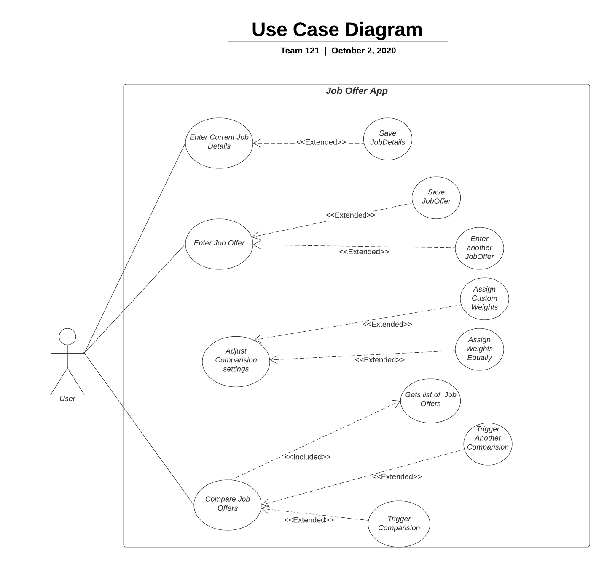

# Use Case Model

**Author**: Team 121

## 1 Use Case Diagram

## 2 Use Case Descriptions

*For each use case in the use case diagram, this section should contain a description, with the following elements:*

- *Requirements: High-level description of what the use case must allow the user to do.*e
- *Pre-conditions: Conditions that must be true before the use case is run.*
- *Post-conditions Conditions that must be true once the use case is run.*
- *Scenarios: Sequence of events that characterize the use case. This part may include multiple scenarios, for normal, alternate, and exceptional event sequences. These scenarios may be expressed as a list of steps in natural language or as sequence diagrams.*

1. Enters current job details 
Pre Conditions: User must be in the system
Post conditions: Details are saved and redirected to main menu or user is redirected to main menu without saving (Extends)
Scenarios: 
Normal: User enters details in the Job interface on the client. The user then can save the details in they system.

Alternate: User enters details in the Job interface on the client. The user then can exit without saving anything to the system.

2. Enter Job Offers 
Pre Conditions: User must be in the system
Post conditions: 
Details are saved and redirected to main menu or user is redirected to main menu without saving
Scenarios: 
Normal: User is shown a interface and enters the details of the job offer. From there the user can click save and it'll save to the system. 

Alternate: User is shown a interface and enters the details of the job offer. From there the user can click save and it'll save to the system. The user can also enter another offer, which would simply repeat the process with a different job offer. 

Alternate: User is shown a interface and can enter the details of the job offer. The user can cancel which would redirect to main menu.

3. Adjust comparision settings
Pre Conditions: User must be in the system
Post conditions: Details are saved and redirected to main menu or user is redirected to main menu without saving
Scenarios: 
Normal: User enters custom weights for all factors
Alternate: No weights assigned, system will treat all factors equally

4. Compare job offers 
Pre Conditions: User must be in the system. User must have job offers entered into system.
Post conditions: Details are saved and redirected to main menu or user is redirected to main menu without saving
Scenarios: 
Normal: User chooses 2 jobs and clicks on the trigger comparision button. User returns to main menu
Alternate: User chooses 2 jobs and clicks on the trigger comparision button. User performs another comparision.