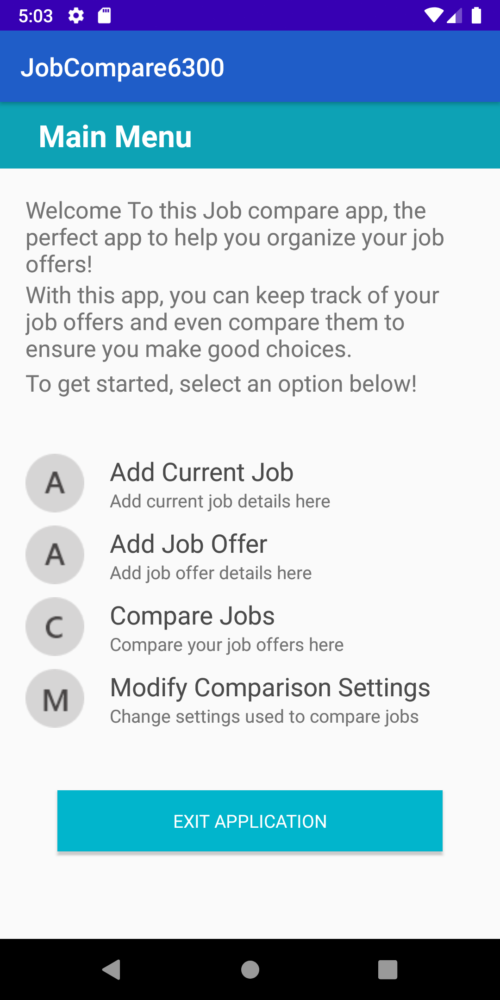
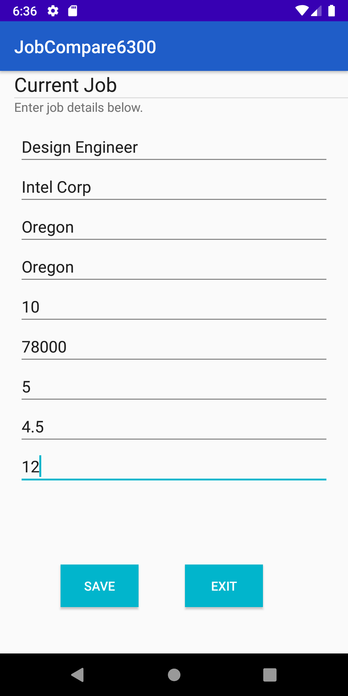
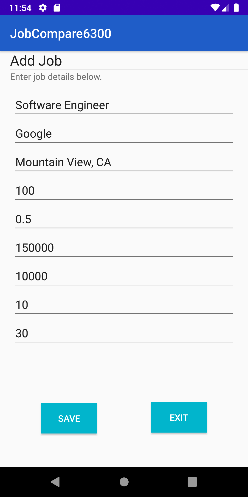
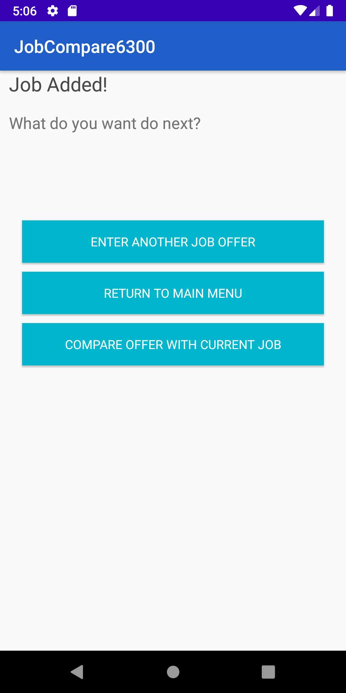
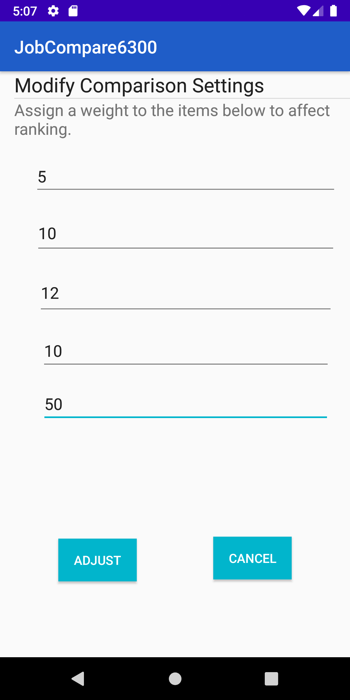
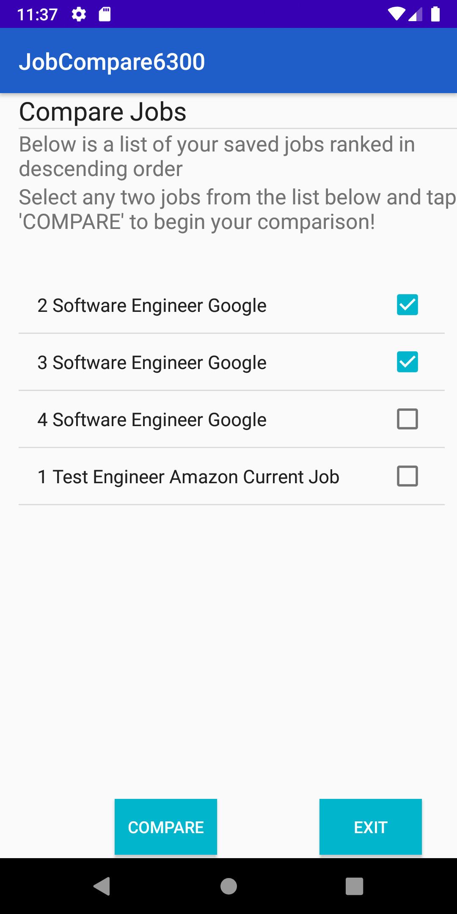
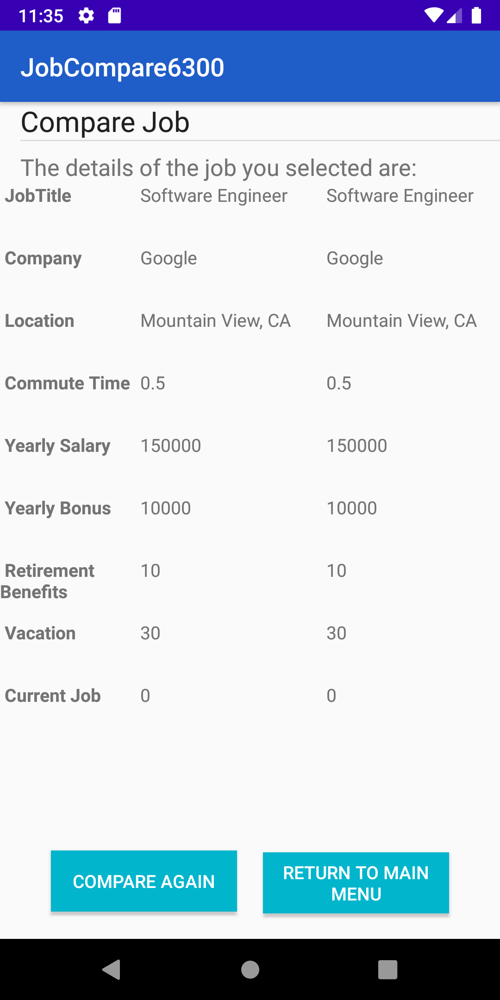

# User Manual

**Author**: Team 121

**Version History**:

- Version 1 - Initial release.
- Version 2 - Final release. Updates to application screenshots and descrition

## Contents

- Introduction
- Add Current Job
- Add New Job Offer
- Compare Jobs
- Modify Comparison Settings
- Progress So Far 

## Introduction

This is Team 121's Group Project for Georgia Tech CS6300: Software Development Process. For this project, we created a Job Compare Android Application. This application is designed with the following features outlined in this User Manual: Add Current Job, Add New Job Offer, Compare Jobs and Modify Comparison Settings. The **Main Menu** (shown below) gives the user the options to  - **Add Current Job**, **Add New Job Offer**, **Compare Jobs** and **Modify Comparison Settings**.

## Add Current Job

The user selects **Add Current Job** from the **Main Menu**. In the interface that comes up, the user enters the details of the current job - **Job Title**, **Company Name**, **Location**, **Overall Living Cost**, **Commute Time**, **Yearly Salary**, **Yearly Bonus**, **Retirement Benefits** and **Leave Time**. The user can then save the entry or exit that particular interface and return to the main menu.

## Add New Job Offer

The user selects **Add Current Job** from the **Main Menu**. In the interface that comes up, the user enters the details of the current job - **Job Title**, **Company Name**, **Location**, **Overall Living Cost**, **Commute Time**, **Yearly Salary**, **Yearly Bonus**, **Retirement Benefits** and **Leave Time**. The user can then save the entry, enter a new job entry or exit that particular interface and return to the main menu as shown in the image below.

## Compare Jobs

This interface is used to compare jobs (new job offer with current job or with any other job offer). 

This interface is used to assign weights to the **Commute Time**, **Yearly Salary**, **Yearly Bonus**, **Retirement Benefits** and **Leave Time**.  The interface for modifying comparison settings is as shown below:

The user is presented with an option to chose which jobs he/she wants to compare. The interface for modifying comparison selection is as shown below:

Finally, when **compare** button is pressed, a side by side comparison of the selected jobs is presented to the user.

